# 易好短剧(Yihao Shorts)工具分析报告

> 分析对象:http://localhost:3013/ · 版本 v1.0.0 · 开源地址 https://github.com/hzerther-hub/drama
> 分析方式:浏览器实际操作(黑盒),全程截图记录 · 分析日期:2026-09-29
> 截图目录:`docs/screenshots/`

---

## 一、工具定位

**易好短剧**是一个"小说 → 短剧"的 AI 全流程本地创作工具,官方口号:

> 从一个创意到一部短剧,AI 全流程为你代工

核心能力是把一段小说原文(或大纲)经过 **剧本化改写 → 角色/场景/道具资产提取与生图 → 分镜拆解 → 镜头视频生成 → 漫画出图 → 拼接合成成片** 的完整流水线,自动产出可下载的短剧成片,同时支持生成漫画条漫和营销宣传内容。

---

## 二、多语言支持(用户重点关注)

### 2.1 界面语言:共 **15 种**

顶栏"切换界面语言"按钮(当前中文)点开后的完整列表:

| # | 语言 | # | 语言 | # | 语言 |
|---|------|---|------|---|------|
| 1 | 中文 | 6 | Deutsch(德语) | 11 | العربية(阿拉伯语) |
| 2 | English(英语) | 7 | Italiano(意大利语) | 12 | Español(西班牙语) |
| 3 | 日本語(日语) | 8 | Português(葡萄牙语) | 13 | Bahasa Indonesia(印尼语) |
| 4 | 한국어(韩语) | 9 | Tiếng Việt(越南语) | 14 | हिन्दी(印地语) |
| 5 | Français(法语) | 10 | Türkçe(土耳其语) | 15 | ภาษาไทย(泰语) |

覆盖东亚、东南亚、南亚、中东、欧洲、美洲主要语种,明显面向出海/多地区创作者。

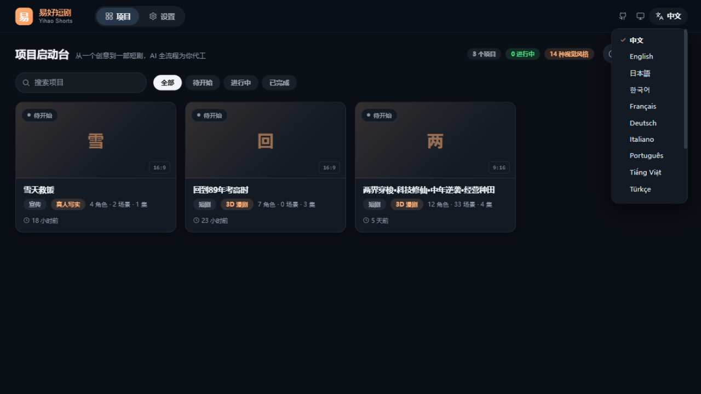

### 2.2 AI 内容语言:**4 种**(与界面语言是两套体系)

设置 → 通用 → "AI 内容语言":控制**界面 + AI 产出内容**(剧本 / 资产 / 分镜 / 提示词)的统一语言,仅支持:

- 中文 / English / 日本語 / 한국어

> 注意区别:**界面可切 15 种,但 AI 生成内容只支持 4 种**。界面语言与内容语言两处入口(顶栏按钮 / 设置页)等价,切换即全局生效并自动刷新。

### 2.3 其他本地化细节

- **人物面孔文化**选项:智能匹配(按项目语言自动推断族群)——中文/日韩 → 东亚;阿拉伯/土耳其 → 中东;欧美语种 → 西方。保证生成角色的面孔符合目标市场。
- 外观主题:浅色 / 深色 / 跟随系统。

---

## 三、整体使用流程

```
项目启动台(首页)
   └─ 新建项目(选创作目标/视觉风格/画面比例/面孔文化)
         └─ 项目页(剧集列表 + 素材库)
               └─ 进入某一集的制作页 —— 六阶段流水线:
                    ① 原始内容(粘贴小说/AI写小说)
                    ② AI 改写(小说 → 格式化剧本)
                    ③ 视漫制作(提取并生成 角色/场景/道具 资产图)
                    ④ 分镜(剧本 → 镜头级拆解 → 批量生成视频)
                    ⑤ 漫画(分镜 → 漫画格出图 → 拼长图)
                    ⑥ 拼接导出(镜头视频合成成片 → 下载)
```

以下按实际操作顺序详述。

---

## 四、项目启动台(首页)

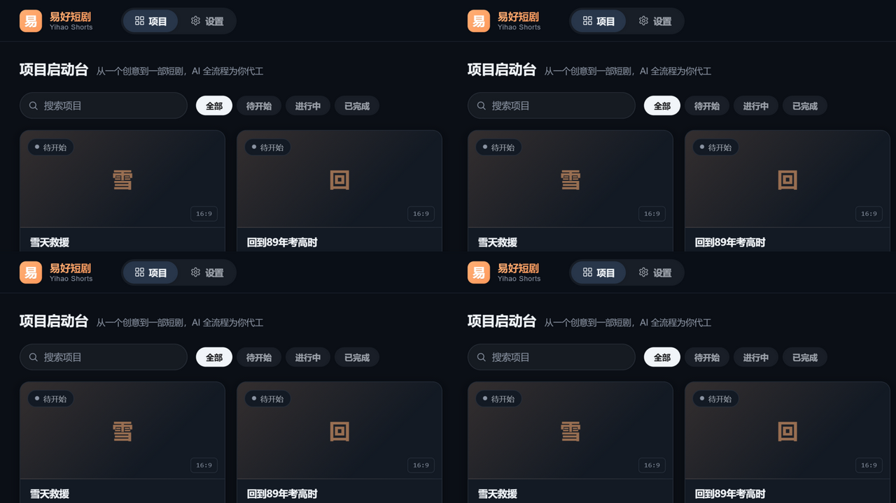

- 顶部统计:**3 个项目 / 0 进行中 / 14 种视觉风格**;
- 项目卡片:显示类型标签(短剧/宣传)、视觉风格、画面比例(16:9 / 9:16)、"N 角色 · N 场景 · N 集"、更新时间、状态(待开始/进行中/已完成);
- 筛选:全部 / 待开始 / 进行中 / 已完成;支持按"最近更新"排序、按名称搜索;
- 卡片"更多"菜单:**打开项目 / 删除项目**(删除有二次确认,提示"剧集、分镜与生成记录将一并删除,不可恢复");
- 顶栏:项目 / 设置 导航、GitHub 链接、切换主题、切换界面语言;
- 示例数据:"两界穿梭·科技修仙·中年逆袭·经营种田"(12 角色 · 33 场景 · 4 集)、"回到89年考高时"、"雪天救援"(宣传类 · 真人写实)。

---

## 五、新建项目(四种创作目标逐一实测)

点"新建项目"弹出对话框,包含:**项目名称(必填)、创作目标、视觉风格、画面比例、人物面孔文化**。

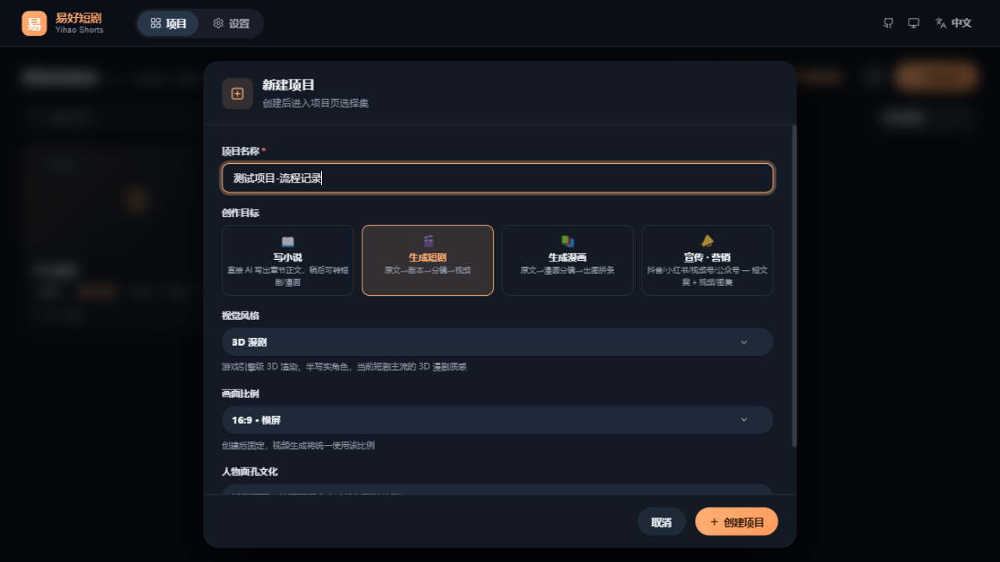

### 5.1 四种创作目标

| 创作目标 | 图标 | 说明(界面原文) | 附带表单变化 |
|----------|------|------------------|--------------|
| 📖 **写小说** | 📖 | 直接 AI 写出章节正文,稍后可转短剧/漫画 | 基础表单 |
| 🎬 **生成短剧**(默认) | 🎬 | 原文 → 剧本 → 分镜 → 视频 | 基础表单 |
| 📚 **生成漫画** | 📚 | 原文 → 漫画分镜 → 出图拼条 | 基础表单 |
| 📣 **宣传 · 营销** | 📣 | 抖音/小红书/视频号/公众号 — 短文案 + 视频/图集 | **新增"目标平台"与"输出格式"两个必填项**,默认风格自动切为"治愈系" |

四种目标逐一选中截图:

- 写小说: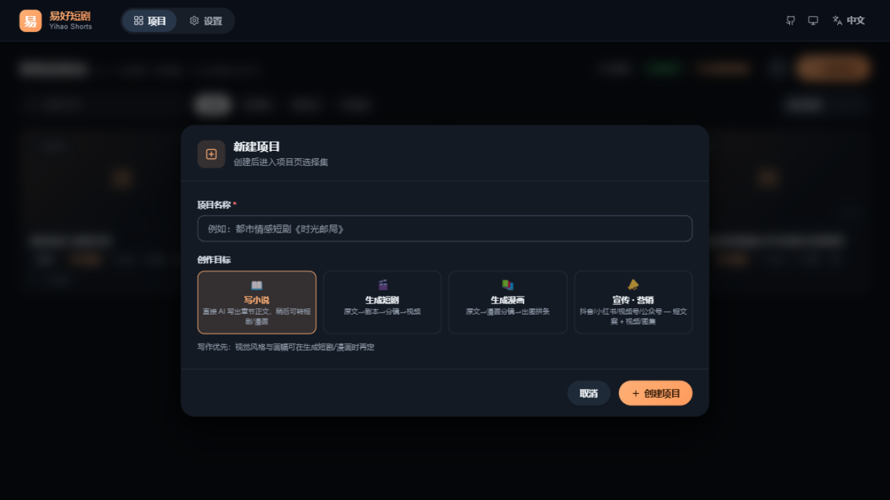
- 生成短剧: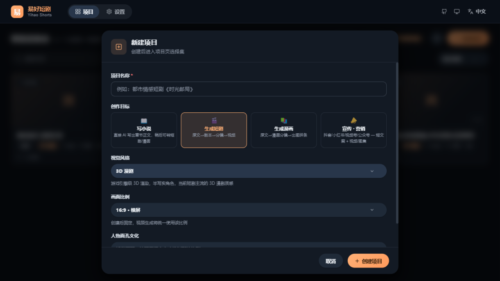
- 生成漫画: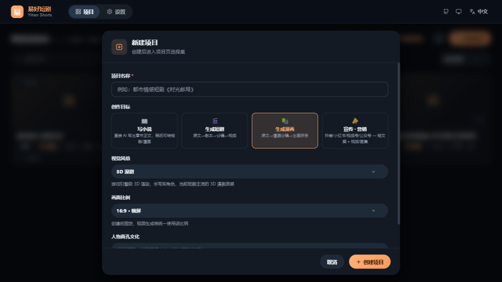
- 宣传·营销: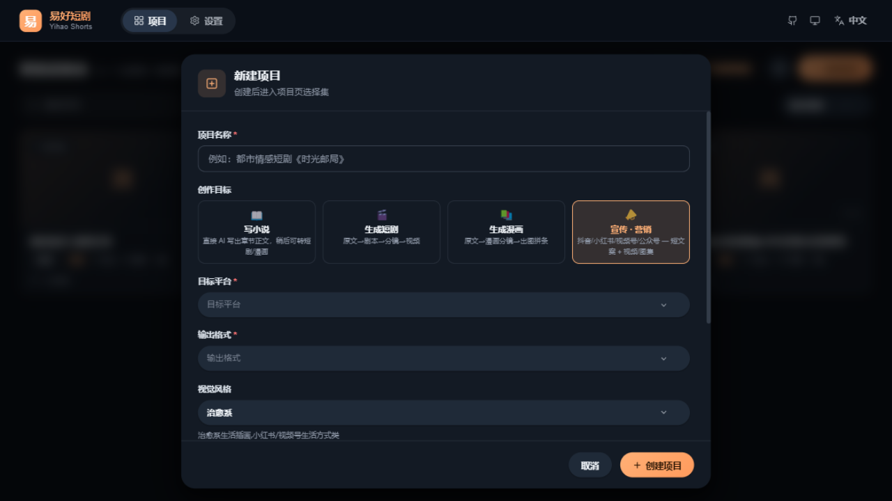

### 5.2 宣传·营销专属选项(实测展开)

选中"宣传 · 营销"后表单新增:

- **目标平台**(6 选):抖音、小红书、视频号、公众号、B站、知乎
  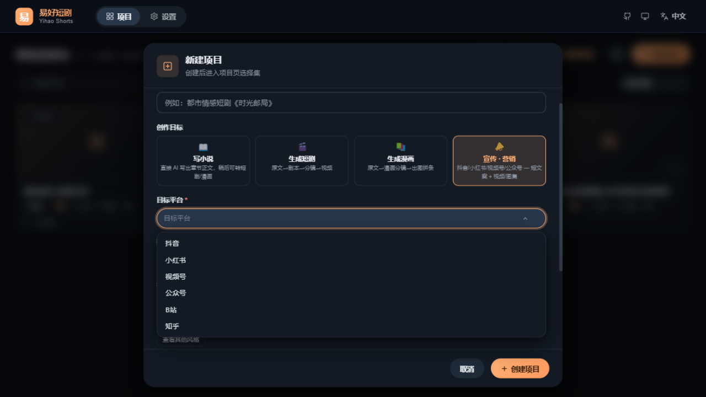
- **输出格式**(6 选):短视频、图文集、卡点、混剪、口播、长图文
  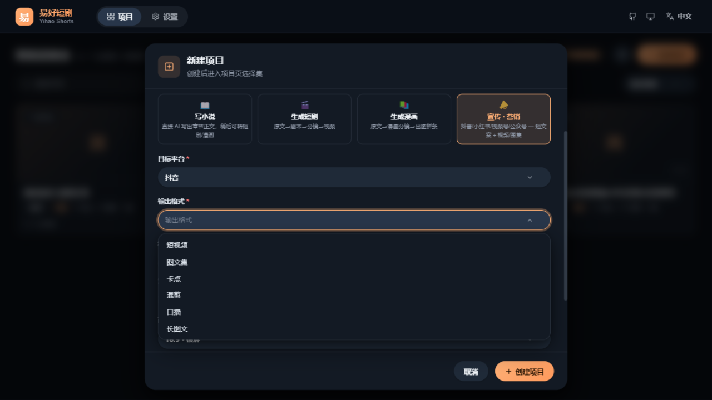
- 视觉风格默认值变为"治愈系"(治愈系生活插画,小红书/视频号生活方式类),并提供"查看其他风格"入口。

### 5.3 视觉风格:共 **14 种**(下拉分两组)

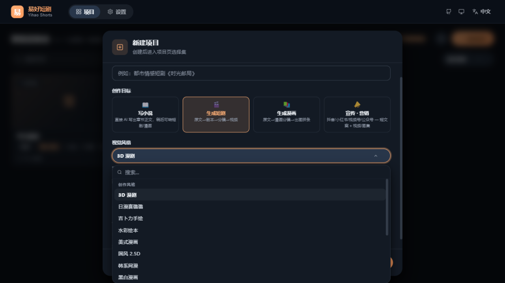

| 分组 | 风格 |
|------|------|
| 创作风格(8) | 3D 漫剧(默认)、日漫赛璐璐、吉卜力手绘、水彩绘本、美式漫画、国风 2.5D、韩系网漫、黑白漫画 |
| 通用风格(6) | 治愈系、ins 风、赛博朋克、复古港风、国潮、真人写实 |

### 5.4 其他选项

- **画面比例**:如 16:9 · 横屏(创建后固定,视频生成统一使用该比例;示例项目也有 9:16 竖屏);
- **人物面孔文化**:智能匹配 / 东亚 / 中东 / 西方。

### 5.5 创建动作(实测)

填写名称"测试项目-流程记录"(默认生成短剧 + 3D 漫剧 + 16:9),点"创建项目"后**直接跳转进新项目第 1 集的制作页**(`/drama/17/episode/1`),落在"① 原始内容"空白阶段,状态 0/2、0 角色 · 0 段落,等待录入小说原文:

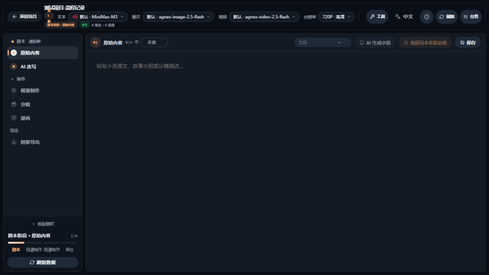

> 与对话框副标题"创建后进入项目页选择集"略有出入:实际是项目页 + 第 1 集制作页二合一进入。测试项目验证后已在首页"更多 → 删除项目"中删除,数据恢复原状(3 个项目)。

---

## 六、项目页(剧集管理 + 素材库)

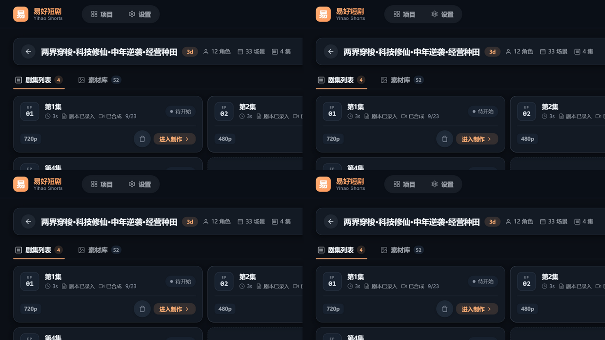

以示例项目"两界穿梭·科技修仙·中年逆袭·经营种田"(3D 漫剧 · 9:16)为例:

- 头部:12 角色 · 33 场景 · 4 集;按钮:**项目设置 / 宣传文案(📣)/ 添加集**;
- 左右两个标签页:
  - **剧集列表(4)**:EP01–EP04 卡片,每集显示状态(剧本已录入 / 已合成)、镜头进度(如 9/23)、分辨率(720p / 480p,逐集独立)、"进入制作"、"删除本集",底部可"添加第 5 集";
  - **素材库(52)**:项目级资产库,**全部 / 角色 / 场景 / 道具**四类筛选。角色 12 个,每张卡显示"形象已生成"、主角/配角/龙套分级、样貌与妆造描述、重绘 / 上传 / 最终提示词入口。素材跨集复用,保证全剧角色形象一致。

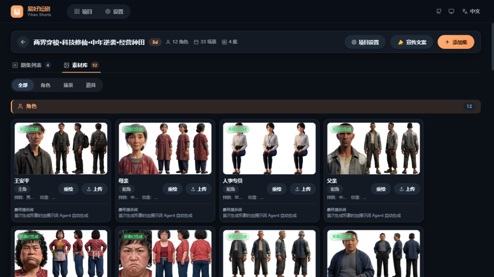

---

## 七、集制作页:六阶段流水线(核心)

进入 `/drama/1/episode/1` 后,左侧栏是流水线导航(带 1/4 → 4/4 进度),顶栏是**模型链选择器**:

- 文本:默认 MiniMax-M3(可选 M2/M2.5/M2.7/M2.1)
- 图片:默认 agnes-image-2.5-flash
- 视频:默认 agnes-video-2.5-flash
- 分辨率:720P · 高清(或 480P)
- 另有:工具 / 使用引导 / 刷新 / 任务(任务面板看生成队列)

### ① 原始内容(1/4)

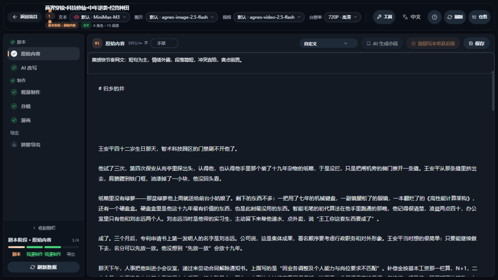

- 大文本框:粘贴小说原文 / 故事大纲 / 分镜描述(示例为小说《归乡的井》,约 3951 字);
- **本章目标字数**(留空不限);**文风**可自定义(示例:"爽感快节奏网文:短句为主,情绪外露,段落简短,冲突直给,爽点前置");
- 按钮:**AI 生成小说**(从零生成)、**批量写本章及后续**、保存。

### ② AI 改写(1/4)

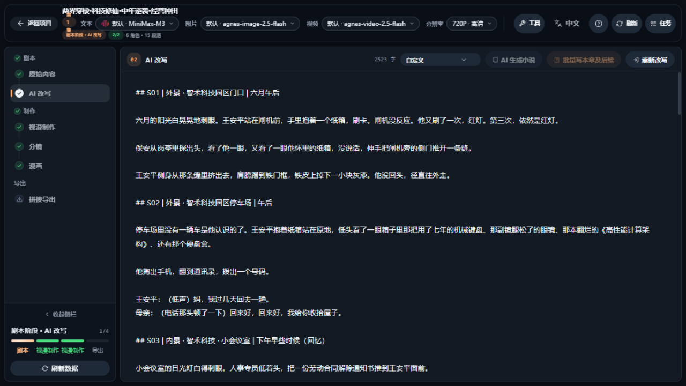

- 把原文改写为**格式化剧本**(示例输出 2523 字):场景头 `## S01 | 外景 · 智术科技园区门口 | 六月午后`,动作描写 + `角色名:(状态)台词` 的对白格式,每场景 30–60 秒内容;
- 支持"重新改写";由"剧本改写 Agent"(script_rewriter)执行。

### ③ 视漫制作(2/4)—— 资产提取与生成

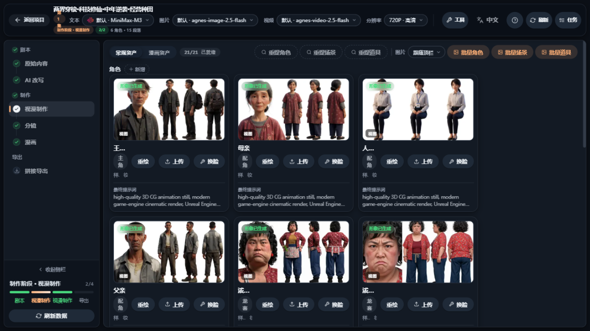

分"常规资产 / 漫画资产"两个标签。示例集:21/21 已就绪(6 角色 + 13 场景 + 2 道具):

- **角色**:自动提取出 王安平(主角)、母亲(配角)、人事专员(配角)、父亲(配角)、泼妇甲/乙(龙套)。每个角色有 AI 生成的**样貌 + 妆造**结构化描述,以及"最终提示词"(自动生成三视图参考图提示词:正脸特写 + 正/侧/背三张等高全身图,纯白背景);
- **场景**:每个场景有描述 + **光照**(时段/光质/氛围)+ 最终提示词(固定机位广角、前景/中景/后景三层分层构图、空场景、电影质感);
- **道具**:如"劳动合同解除通知书(文件)"、"上海牌机械手表(信物)",单品产品图提示词;
- 操作:**重提角色/场景/道具**(重新用 AI 提取)、**批量角色/场景/道具**(批量生图)、单个**重绘 / 上传 / 换脸**(本地 InsightFace 人脸融合)。

### ④ 分镜(3/4)—— 镜头级拆解 + 视频生成

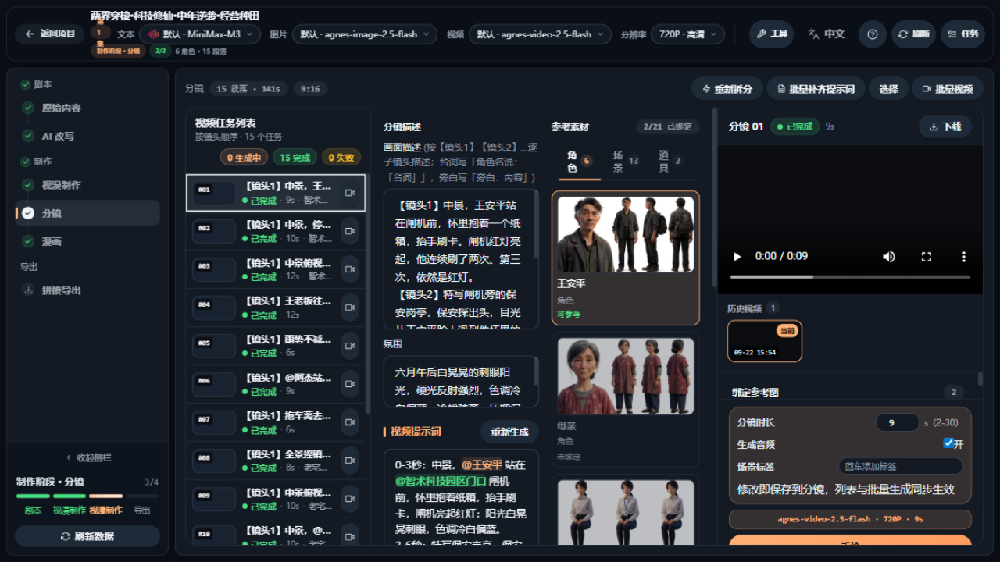

- 15 段落 · 总时长 141s · 画面比例 9:16;
- 每段落被拆成 `【镜头1】【镜头2】…` 的导演级描述(景别、机位、动作、台词),并 `@角色名`/`@道具` 引用资产;
- 按钮区:**重新拆分 / 批量补齐提示词 / 批量视频**;
- **视频任务列表**:15 个任务,状态统计(0 生成中 / 15 完成 / 0 失败),每段可单独"重绘"。

### ⑤ 漫画(3/4)—— 条漫出图

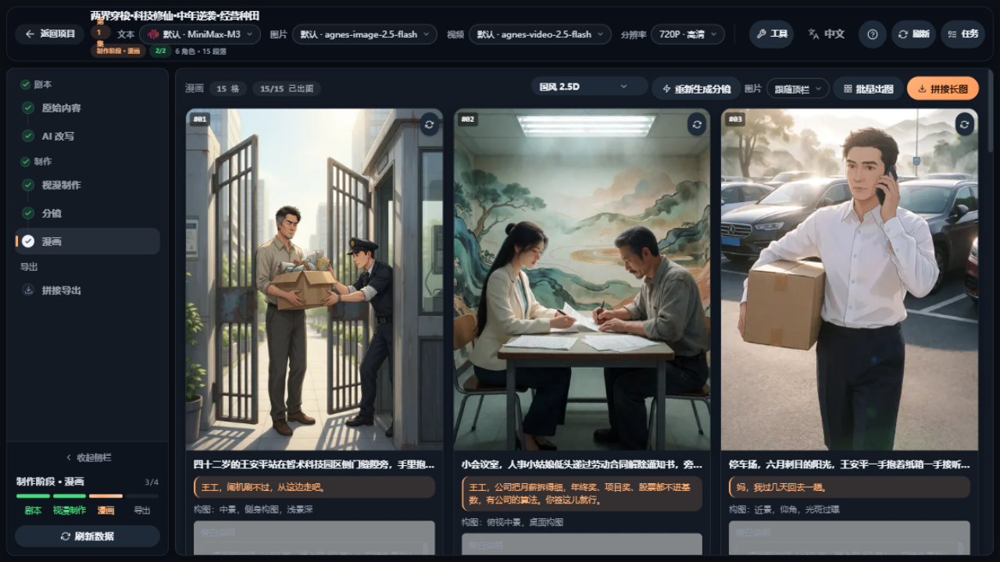

- 15 格,15/15 已出图,画风:国风 2.5D(可切换);
- 每格含:生成的漫画图 + 画面描述 + 对白 + 构图说明(如"中景,侧身构图,浅景深")+ **旁白解说词**(≤50 字,可手填或 AI 生成)+ 出图提示词;
- 按钮:重新生成分镜 / **批量出图 / 拼接长图**。

### ⑥ 拼接导出(4/4)—— 合成成片

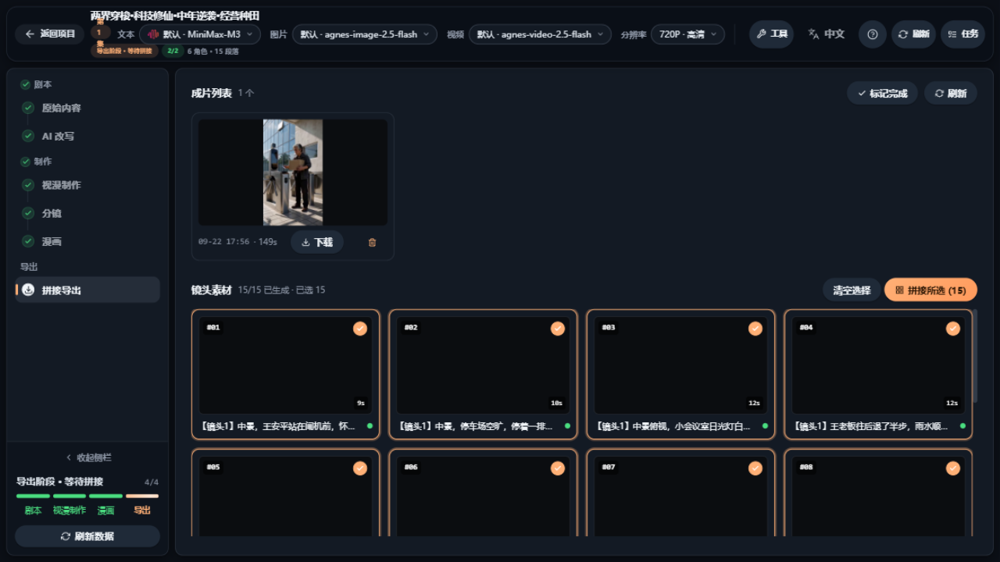

- **成片列表**:已有 1 个成片(09-22 17:56 · 149s),可**下载 / 删除**,可"标记完成";
- **镜头素材**:15/15 已生成,默认全选,支持勾选后"**拼接所选 (15)**"合成新成片;每个镜头可单独播放预览。

---

## 八、设置(六大分区)

侧栏:AI 服务 / 通用 / 风格预设 / Agent 配置 / 存储位置 / 关于更新。

### 8.1 AI 服务(多供应商模型接入)

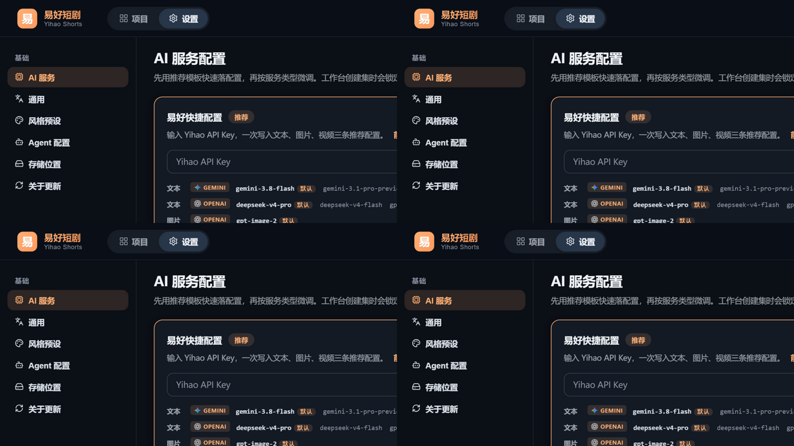

- **易好快捷配置**:输入 Yihao API Key(前往 易智 ezhi.mei.biz 获取),一次写入文本/图片/视频三条推荐配置;
- 推荐模板展示的模型矩阵:文本(gemini-3.8-flash / deepseek-v4-pro / gpt-5.6-terra…)、图片(gpt-image-2 / gemini-3-pro-image…)、视频(wan3.0-video / doubao-seedance-2.0 / MiniMax-H3…);
- 四类服务可分别配置多个供应商,已启用示例:
  - **文本(1)**:MiniMax 官方(MiniMax-M3 默认)
  - **图片(3)**:Agnes 官方(agnes-image-2.5-flash)、火山方舟 Doubao Seedream 5.0、**本地 InsightFace 人脸融合 CPU 版**(inswapper_128 @ 127.0.0.1:5678)
  - **视频(1)**:Agnes 官方(agnes-video-2.5-flash);火山豆包 Seedance 2.0 已停用
  - **配音(1)**:豆包语音(火山引擎,BV001_streaming,拼接时混入视频音轨)
- 每条配置可测试连通、启用/停用。

### 8.2 Agent 配置(内置 9 类 AI Agent,提示词全开放)

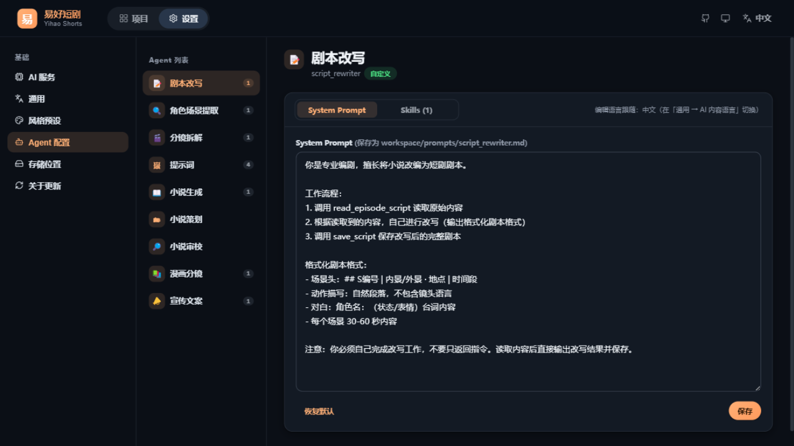

| Agent | 数量 | 职责 |
|-------|------|------|
| 📝 剧本改写(script_rewriter) | 1 | 小说 → 格式化剧本 |
| 🔍 角色场景提取 | 1 | 从剧本提取角色/场景/道具 |
| 🎬 分镜拆解 | 1 | 剧本 → 镜头级分镜 |
| 🖼 提示词 | 4 | 角色/场景/道具/镜头出图提示词 |
| 📖 小说生成 | 1 | 从零写小说正文 |
| 🗂 小说策划 | 0(可加) | 小说大纲策划 |
| 🔎 小说审校 | 0(可加) | 小说审校 |
| 📚 漫画分镜 | 1 | 漫画格拆解 |
| 📣 宣传文案 | 1 | 平台营销文案 |

每个 Agent 的 **System Prompt 可直接编辑**(保存为 `workspace/prompts/*.md`)、支持 Skills 附加、可恢复默认。例如剧本改写 Agent 的系统提示词明确要求:"调用 read_episode_script 读取原始内容 → 自行改写为格式化剧本 → 调用 save_script 保存"——即 Agent 以"工具调用"方式驱动流水线。

### 8.3 其他

- **通用**:AI 内容语言(4 种)、主题模式;
- **风格预设**:视觉风格预设管理;
- **存储位置**:数据落盘路径;
- **关于更新**:v1.0.0;从发布清单拉取新版本、本地 sha256 校验后自动换包重启,用户数据不受影响;Docker + Watchtower 可一键更新。

---

## 九、流程总结与技术亮点

1. **一条流水线吃下"小说→成片"全链路**,每个阶段既是自动的(批量按钮)又是可干预的(逐条重绘/重提/手改提示词)。
2. **一致性工程**:项目级素材库跨集复用;分镜用 `@角色名` 显式引用资产;角色三视图提示词 + 换脸(InsightFace)保证跨镜头形象统一;场景提示词固定"三层构图 + 空场景"规范。
3. **模型链可插拔**:文本/图片/视频/配音四类各自独立配置多供应商(闭源 API + 本地模型均可),逐集还能覆盖分辨率。
4. **Agent 提示词全开放**:9 类 Agent 的 System Prompt 存为 Markdown 文件可深度定制,适合有自己方法论的工作室。
5. **多语言/出海导向**:15 种界面语言 + 面孔文化智能匹配(东亚/中东/西方)+ 9:16 竖屏与抖音/小红书等平台预设。
6. **本地优先**:数据存系统数据目录,支持 Docker 部署与 Watchtower 自动更新。

---

## 附:截图清单

| 文件 | 内容 |
|------|------|
| 01-home.png | 项目启动台首页 |
| 02-languages.png | 界面语言菜单(15 种) |
| 03-new-project-dialog.png | 新建项目对话框 |
| 04-visual-styles.png | 14 种视觉风格下拉 |
| 05-project-episodes.png | 项目页·剧集列表 |
| 06-episode1-ai-rewrite.png | 阶段② AI 改写(格式化剧本) |
| 07-episode1-raw-content.png | 阶段① 原始内容(小说录入) |
| 08-assets.png | 阶段③ 视漫制作(角色/场景/道具) |
| 09-storyboard.png | 阶段④ 分镜(镜头拆解+视频任务) |
| 10-comic.png | 阶段⑤ 漫画(15 格出图) |
| 11-export.png | 阶段⑥ 拼接导出(成片下载) |
| 12-asset-library.png | 项目素材库(52 项) |
| 13-settings-ai.png | 设置·AI 服务(多供应商) |
| 14-agent-config.png | 设置·Agent 配置(9 类) |
| 15-created-project.png | 实际创建项目后的第 1 集页面 |
| 16~19-goal-*.png | 四种创作目标逐一选中 |
| 20/21-goal-marketing-*.png | 宣传营销的目标平台/输出格式下拉 |
